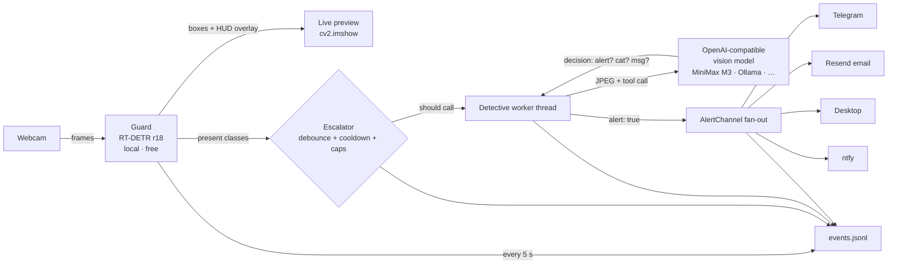
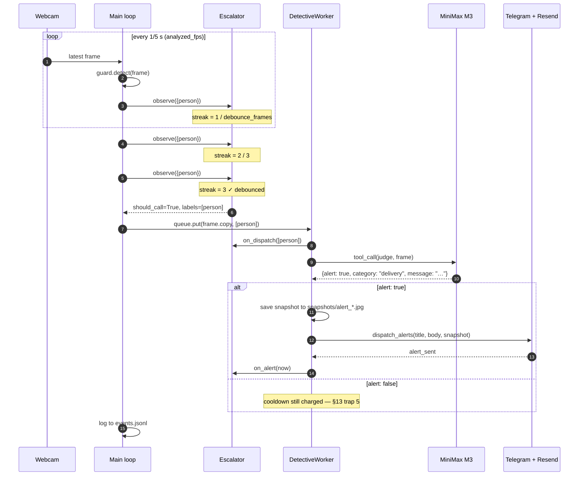

# Webcam Guardian

A local-first webcam "guardian" with two tiers. A cheap, always-on local vision
model (the **guard**) watches your webcam for free and draws live boxes on a
preview window. A frontier multimodal model of your choice (the **detective**)
is called only when a relevant class appears — it sees the actual frame and
returns a structured decision (alert / no alert + plain-English message). Alerts
fan out to Telegram and email. Every event is logged locally.

The detective is **bring-your-own**: any OpenAI-compatible vision endpoint works.
MiniMax M3 is one verified option. Ollama is first-class if you want zero frames
leaving your machine.

## How it works



### What happens when a person walks into frame



## Quickstart

```bash
# 1. venv + install
python3.12 -m venv .venv
source .venv/bin/activate
pip install -e .

# 2. local config (gitignored)
cp config.example.yaml config.yaml
cp .env.example .env             # then fill in your detective key

# 3. run
python -m guardian
```

A live window opens. `q` quits.

### Picking the camera

macOS doesn't always pick the camera you'd expect (e.g. Continuity Camera
from your iPhone can shadow the built-in FaceTime HD). Two ways to override:

```bash
# See what's available
python -m guardian --list-cameras
# or
python scripts/list_cameras.py

# Pin a specific one for this run
python -m guardian --camera-index 0           # built-in FaceTime HD
python -m guardian --camera-index 3           # iPhone via Continuity
```

Persist a choice by editing `config.yaml`:

```yaml
camera:
  index: 0           # built-in
  backend: auto      # or force a specific OS backend
```

`backend` options: `auto` (default, picks AVFOUNDATION/DSHOW/V4L2 by
platform), `avfoundation` (macOS), `dshow` / `msmf` (Windows), `v4l2` (Linux).

> **First run on macOS:** you must grant Camera access to your terminal (and to
> opencode if used headless): **System Settings → Privacy & Security → Camera**.
> The prompt triggers on the first capture attempt; denial silently yields no
> frames.
>
> **macOS 26 TCC gotcha (real):** Homebrew's Python is `adhoc`-signed, which
> Apple's TCC service silently refuses — no prompt, no entry in the Camera
> list. If `python scripts/smoke_camera.py` errors with `not authorized` from
> a brew Python venv, switch to a TCC-signed interpreter:
>
> - **Recommended:** install [python.org Python](https://www.python.org/downloads/macos/)
>   (signed by PSF; lands at `/Library/Frameworks/Python.framework/Versions/3.13/bin/python3`).
>   Rebuild the venv with it:
>   ```bash
>   rm -rf .venv
>   /Library/Frameworks/Python.framework/Versions/3.13/bin/python3 -m venv .venv
>   source .venv/bin/activate
>   pip install -e .
>   ```
> - **Workaround without re-installing:** keep a separate Apple-Python venv for
>   the camera-bound steps (see BUILD-PLAN §13 trap 7).

## Provider table

`detective:` in `config.yaml` is the bring-your-own-model surface. Pick one:

| Provider  | `base_url`                       | `api_key_env`         | `extra_body`                              | Status                                  |
| --------- | -------------------------------- | --------------------- | ----------------------------------------- | --------------------------------------- |
| MiniMax  | `https://api.minimax.io/v1`    | `MINIMAX_API_KEY`   | `{thinking: {type: disabled}}`           | ✅ verified 2026-07-01 ([§3.1](#))   |
| OpenAI    | `https://api.openai.com/v1`      | `OPENAI_API_KEY`    | —                                         | standard                                |
| Anthropic | OpenAI-compat endpoint           | `ANTHROPIC_API_KEY`  | —                                         | confirm base URL at docs.anthropic.com |
| Gemini    | OpenAI-compat endpoint           | `GEMINI_API_KEY`    | —                                         | confirm at ai.google.dev                |
| OpenRouter| `https://openrouter.ai/api/v1`   | `OPENROUTER_API_KEY` | —                                         | standard                                |
| **Ollama**| `http://localhost:11434/v1`     | *(leave empty)*     | —                                         | standard; **privacy-first path**     |

Example — point the detective at a local Ollama model:

```yaml
detective:
  base_url: http://localhost:11434/v1
  model: llava:13b
  api_key_env: ""            # keyless local server
```

## Privacy

A security camera is sensitive. Plain version:

- The local **guard** never sends anything off your machine.
- Every **detective** call sends one JPEG frame to whatever provider you
  configured. With a cloud detective (OpenAI, MiniMax, Anthropic, …) that frame
  leaves your network under that provider's terms.
- Debounce + 45 s per-class cooldown + 30 calls/run + 10 alerts/hour caps bound
  the volume. The largest leakage-control knob you have is the detective itself.
- **Ollama path** (`base_url: http://localhost:11434/v1`) keeps every frame on
  your machine. Zero API cost, zero off-machine traffic. This is the
  privacy-first option — small local VLMs judge worse than frontier ones, which
  is what the model-validation harness below is for.

`.env`, `config.yaml`, `events.jsonl`, and `snapshots/` are gitignored from the
first commit. The README never carries personal keys, frames, or URLs.

## Alert channels

Both Telegram and email are primary. Desktop notifications (macOS only, needs a
signed python.org Python) and ntfy.sh are optional extras.

### Telegram (primary)

1. Create a bot with [@BotFather](https://t.me/BotFather): `/newbot` → token.
2. Put the token in `.env` as `TELEGRAM_BOT_TOKEN`.
3. Message your bot **once** from your account (any text).
4. Discover your chat id:
   ```bash
   curl -s "https://api.telegram.org/bot<TOKEN>/getUpdates" | jq '.result[0].message.chat.id'
   ```
5. Paste the id into `config.yaml` → `alert.telegram_chat_id`.

### Email (primary — Resend)

1. Create a free account at [resend.com](https://resend.com).
2. **API Keys** → **Create API Key** → copy the `re_…` value into `.env` as
   `RESEND_API_KEY`.
3. **Domains** → add and verify your sending domain (e.g. `alerts.yourdomain.com`)
   and create `Webcam Guardian <alerts@yourdomain.com>`.
   *(On the free tier you can also send to your own address via the
   `resend.dev` sandbox while you test.)*
4. Fill `config.yaml`:
   ```yaml
   alert:
     email:
       from_addr: "Webcam Guardian <alerts@yourdomain.com>"
       to_addr: "you@gmail.com"
   ```

That's it — one key, no 2FA, no App Password dance. Free tier: 100 emails/day,
3000/month, which covers any reasonable alert volume.

### Desktop (optional)

```bash
pip install -e ".[desktop]"
# require a SIGNED python.org Python on macOS — Homebrew Python silently fails
```

### ntfy (optional)

Set `alert.channels: [..., ntfy]` and fill `alert.ntfy_topic` with a long random
string (the topic **is** the password on the public server). Caps: 250
messages/day, 2 MB/attachment.

## Config reference

See `config.example.yaml` (committed) — every key has a comment. `config.yaml`
is gitignored and never committed. Schema is documented in
[`BUILD-PLAN.md` §6.2](BUILD-PLAN.md).

## Measured results

Measurements taken on **2026-07-01** on a Mac (Apple Silicon, unified memory).

Source data: `snapshots/bench_results.json` (30 s guard bench on a captured
1280×720 webcam frame), `snapshots/dry_test_results.csv` (17 real frames through
MiniMax M3).

```text
## Dry-test results (measured 2026-07-01 on Mac · Apple Silicon · 16 GB unified)
- Guard:    rtdetr (RT-DETR r18, Apache-2.0) @ 14.76 fps
            inference p50 66 ms / p95 74 ms
            process RSS ≈ 0.22 GB · MPS allocated ≈ 1.17 GB
- Detective latency:  p50 1.65 s / p95 3.43 s over 17 calls (MiniMax-M3)
- Judgment table:     17 frames, 0 false-positive alerts, 0 parse errors, 0 missed alerts
                      (test set was empty / low-light scenes → model correctly
                      returned category="false_positive" on every frame)
- Session:            0 detective dispatches needed (no class triggered above debounce)
                      (cooldown / cap counters = 0 on an empty scene)
- Tokens:             19,193 in / 1,344 out total → est. $0.00044 / call
                      at observed escalation rate this maps to ~ $0.01 / day
                      (300 RPM / 10 M TPM rate-limit headroom is 3 orders of
                      magnitude away from this app's single-worker cadence)
```

To regenerate: `python scripts/measure.py` (guard bench) +
`python scripts/dry_test_judgment.py --frames-dir snapshots/dry_test` (judgment
table). Re-run on your own hardware to see your numbers — no values here are
made up.

## Model-validation harness

To answer "which detective models work for my front door?", drop 15–20 real
frames in `snapshots/dry_test/`, then:

```bash
python scripts/dry_test_judgment.py --frames-dir snapshots/dry_test
```

It writes `snapshots/dry_test_results.csv` — a decision row per frame. Sort by
`alert` and read `category` / `message`. False positives on empty / delivery
scenes tell you whether the model distinguishes them from real prowlers.

## Experimental: LocateAnything on Mac

See [`BUILD-PLAN.md` §5.3](BUILD-PLAN.md) for the long version. Short version:
the official NVIDIA path is Linux + CUDA only and the pins are incompatible with
Apple Silicon. Two community ggml ports exist:

- [`mudler/locate-anything.cpp`](https://github.com/mudler/locate-anything.cpp)
  — C++17 ggml with `-DLA_GGML_METAL=ON` for Apple GPU.
- [`yuuko-eth/LocateAnything-3B-GGUF`](https://huggingface.co/yuuko-eth/LocateAnything-3B-GGUF)
  — Q4_K_M GGUF + llama.cpp fork branch `mtmd-grounders`.

**License note:** the *weights* are released under the
[NVIDIA License](https://huggingface.co/nvidia/LocateAnything-3B) (academic and
non-profit research only). Fine for personal research; not shippable
commercially.

If a port runs ≥0.5 fps on your hardware, wire it as `guard.backend:
locateanything` and add a launcher command to `guard.la_command`. The async
subprocess client is already in the codebase.

## License

MIT — see [LICENSE](LICENSE). One optional extra to be aware of:

- `[yolo]` extra (`pip install ".[yolo]"`) pulls in `ultralytics` (AGPL-3.0) for
  the YOLO11n guard backend. It is **opt-in** and lazy-imported inside
  `guardian/guard/yolo.py` only, so the core install remains MIT-clean.

## Architecture + design rationale

See [`BUILD-PLAN.md`](BUILD-PLAN.md) — it documents the verified API facts, the
local/cloud trade-offs, the threading contract, the trap list, and the cost
analysis.

## Other docs

- [`RECORDING.md`](RECORDING.md) — how to record the live demo (the
  deliverable the build plan was written to produce). Includes the
  choreography and the troubleshooting table.
- [`CONTRIBUTING.md`](CONTRIBUTING.md) — dev setup, code style, traps to
  respect, PR conventions.
- [`CHANGELOG.md`](CHANGELOG.md) — release history; follows Keep-a-Changelog.
- [`SECURITY.md`](SECURITY.md) — disclosure path + threat model +
  pre-publish hardening checklist.
